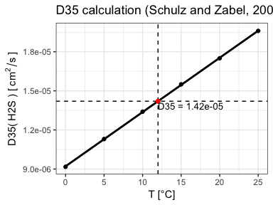

Calculate diffusion coefficients of sea water solutes
================
Marko Lipka
1/18/2018

The diffusivity *D* of solutes in sea water depends on temperature and salnity. It can be linearly interpolated from [temperature dependent theoretical values in de-ionized water](https://www.springer.com/de/book/9783540321439) and in [sea water](https://books.google.de/books/about/Diagenetic_models_and_their_implementati.html?id=kr0SAQAAIAAJ&redir_esc=y) for measured *in-situ* salinity and temperature.

Diffusivity calculation
-----------------------

*calculate.Dsal(el, temperature, salinity)* calculates for given *temperature* (in °C) and *salinity* the diffusion coefficient of a dissolved species *el*, which can be one of the following:

| Solute                        | *el*  |     | Solute                         | *el*   |
|:------------------------------|:------|-----|:-------------------------------|:-------|
| *Ca2+*             | "Ca"  |     | *PO43-*  | "PO4"  |
| *Mg+*              | "Mg"  |     | *HPO42-* | "HPO4" |
| *Na+*              | "Na"  |     | *Sr2+*              | "Sr"   |
| *K+*               | "K"   |     | *H2S*               | "H2S"  |
| *SO42-* | "SO4" |     | *HS-*               | "HS"   |
| *Ba2+*             | "Ba"  |     | *HCO3-*  | "HCO3" |
| *Fe2+*             | "Fe"  |     | *NH4*               | "NH4"  |
| *Li+*              | "Li"  |     | *NO3-*   | "NO3"  |
| *Mn2+*             | "Mn"  |     | *CH4*               | "CH4"  |

The function returns a list of parameters

    ##  [1] "Dsal"      "t"         "sal"       "m0"        "m1"       
    ##  [6] "D0"        "D35"       "plot.D0"   "plot.D35"  "plot.Dsal"

-   The input salinity (*sal*) and temperature (*t*) values.
-   Linear model coefficients *m0* and *m1* and calculated diffusivity *D0* at 0 salinity:
    *D0(T) = (m0 + m1 \* T) \* 10-6 cm2 s^-1* (Boudreau 1997).
-   Interpolated diffusivity *D35* at a salinity of 35 from a temperature-diffusivity relation in the literature (Schulz 2006).
-   Calculated diffusivity *Dsal* at the given salinity, linearly interpolated from *D0* and *D35*.

and three plots showing the calculation of the three diffusivities (*D0*, *D35* and *Dsal*) via linear interpolation.

### Example

Salinity and temperature dependency of molecular diffusivity
------------------------------------------------------------

Correction factors for stoichometric ratio calculations
-------------------------------------------------------

For example diffusivity ratio of *H2S* / *SO42-*:

References
==========

Boudreau, Bernard P. 1997. *Diagenetic models and their implementation: modelling transport and reactions in aquatic sediments*. Berlin: Springer.

Schulz, Horst D. 2006. “Quantification of Early Diagenesis: Dissolved Constituents in Pore Water and Signals in the Solid Phase.” In *Marine Geochemistry*, edited by Horst D. Schulz and Matthias Zabel, 2nd ed., 1–574. Berlin, Heidelberg: Springer-Verlag.
